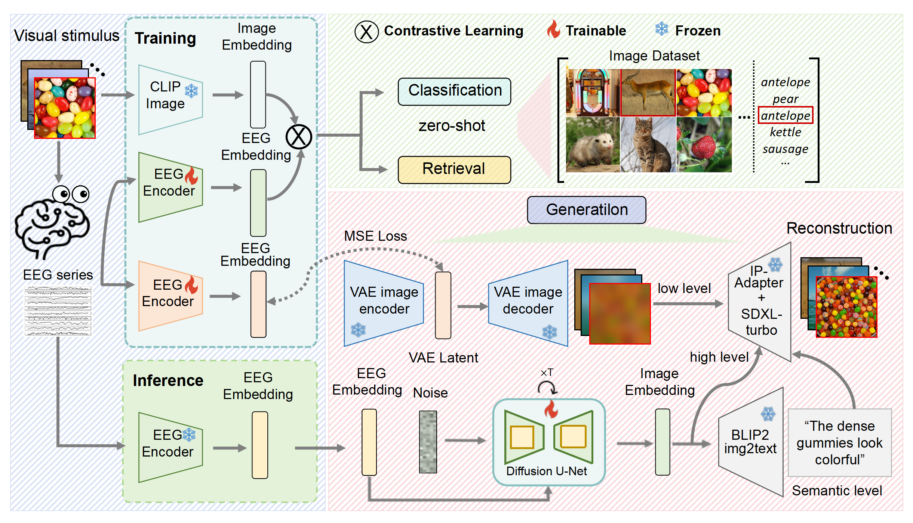
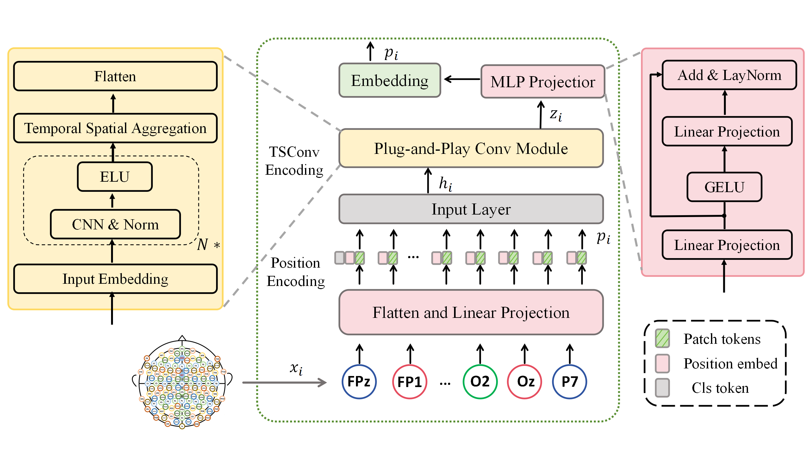

# Visual Decoding and Reconstruction via EEG Embeddings with Guided Diffusion
Using vision-language models to decode and reconstruct natural image perception from non-invasive brain recordings.





## Environment setup
You can create a new conda environment and install the required dependencies
```
# use conda environment.yml:
conda env create -f environment.yml
conda activate BCI
#or pip install -U -r requirements.txt

pip install wandb
pip install einops
```
Additional environments needed to run all the code:
```
pip install open_clip_torch
# LAVIS makes it possible to use any published CLIP base model.
git clone https://github.com/salesforce/LAVIS.git
cd LAVIS
pip install -e .

pip install transformers==0.27.0
pip install diffusers==0.24.0

#Below are the braindecode installation commands for the most common use cases.
pip install braindecode==0.8.1
```
## Training and test 
1.- **ATM_S_insubject_retrieval.py** is provided to learn the training strategy of EEG Encoder and verify it during training. Please modify your data set path and run:
```
cd Retrieval
python ATM_S_insubject_retrieval.py
```
2.- **Generation_measure.ipynb** is provided to learn the Reconstruction strategy of EEG Encoder. Please modify your data set path and run zero-shot on 200 classes test dataset:
```
# 1 step: reconstruct images
Generation_metrics_sub<index>.ipynb
# 2 step: compute metrics
cd Generation/fMRI-reconstruction-NSD/src
Reconstruction_Metrics_ATM.ipynb
```


## Data availability
The raw and preprocessed EEG dataset, the training and test images and the DNN feature maps are available on [osf](https://osf.io/3jk45/). The ILSVRC-2012 validation and test images can be found on [ImageNet](https://www.image-net.org/download.php). 
Also You can get the data set used in this project through the Baidu web disk link [here](https://pan.baidu.com/s/1-1hgpoi4nereLVqE4ylE_g?pwd=nid5).</br>
To run the code, the data must be downloaded and placed into the following directories:

- **Raw EEG data:** `../project_directory/eeg_dataset/raw_data/`.
- **Preprocessed EEG data:** `../project_directory/eeg_dataset/preprocessed_data/`.
- **Training and test images; ILSVRC-2012 validation and test images:** `../project_directory/image_set/`.
- **DNN feature maps:** `../project_directory/dnn_feature_maps/pca_feature_maps`.


## Citation

Here we provide our dataset used in the source of paper:</br>"[A large and rich EEG dataset for modeling human visual object recognition](https://www.sciencedirect.com/science/article/pii/S1053811922008758?via%3Dihub)]".</br>
Alessandro T. Gifford, Kshitij Dwivedi, Gemma Roig, Radoslaw M. Cichy.


Another similar data set provides a reference:</br>"[Human EEG recordings for 1,854 concepts presented in rapid serial visual presentation streams](https://www.nature.com/articles/s41597-021-01102-7)".</br>
Tijl Grootswagers, Ivy Zhou, Amanda K. Robinson, Martin N. Hebart & Thomas A. Carlson .

